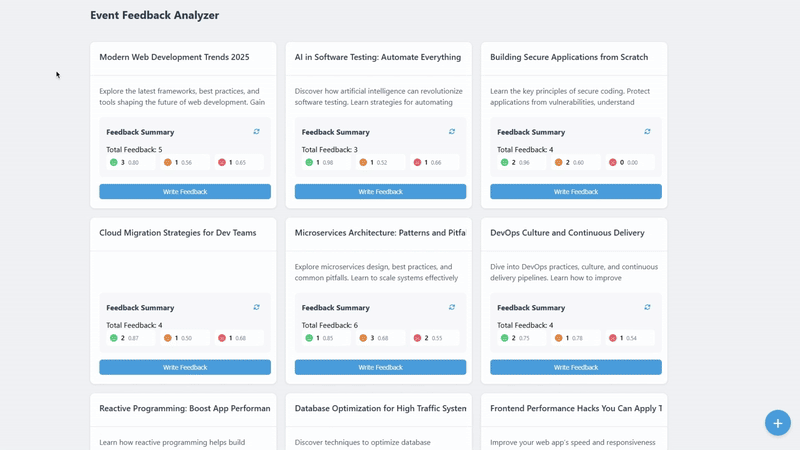

# Event Feedback Analyzer

Event Feedback Analyzer is a web-based application designed to collect and analyze event feedback using sentiment analysis. The system integrates with Hugging Face inference services to classify feedback as positive, neutral, or negative.

Deployed application is available on:\
https://event-analyzer-62743443573.europe-west1.run.app/



## Technologies Used

### Backend
- **Spring Boot** – REST API and application framework
- **Spring Data JPA** – Repository abstraction for database access
- **Hibernate** – JPA persistence provider
- **H2 Database** – In memory storage
- **WebClient (Spring WebFlux)** – For external API calls
- **Hugging Face Inference API** – Sentiment analysis
- **Lombok** – Reduces boilerplate code
- **Maven** – Dependency management and build automation

### Frontend
- **React** – Client application

### Deployment
- **Docker** – Containerization
- **Google Cloud Run** – Cloud deployment

## Prerequisites
Ensure the following tools are installed before running the application locally:
- Java 17
- Node.js 18
- Maven 3.9+
- Docker (optional)

## Running with Maven 

1. Clone the repository
```bash
git clone https://github.com/migle-kirilovaite/Event-Feedback-Analyzer.git
cd Event-Feedback-Analyzer
```
2. Install dependencies
```bash
mvn clean install
```
3. Configure the required environment variable:
- `HUGGINGFACE_API_TOKEN`: Token with permission to access Hugging Face Inference API.

4. Compile the application
```bash
mvn clean compile
```

5. Start the application
```bash
mvn spring-boot:run
```
The application will be available at:\
http://localhost:8080/

## Running with Docker

1. Clone the repository
```bash
git clone https://github.com/migle-kirilovaite/Event-Feedback-Analyzer.git
cd Event-Feedback-Analyzer
```

2. Build the Docker image
```bash
docker build -t event-feedback-analyzer .
```

3. Run the container
```bash
docker run -p 8080:8080 event-feedback-analyzer -e HUGGINGFACE_API_KEY=YOUR_HUGGINGFACE_API_KEY
```

After the container starts, access the application at:\
http://localhost:8080

## Accessing Swagger UI
Interactive API documentation is available through Swagger UI:\
http://localhost:8080/swagger-ui.html \
**Note**: This is not available in deployed application.

## Test coverage
The application has been thoroughly tested using both unit and integration tests, achieving test coverage of 88%.
